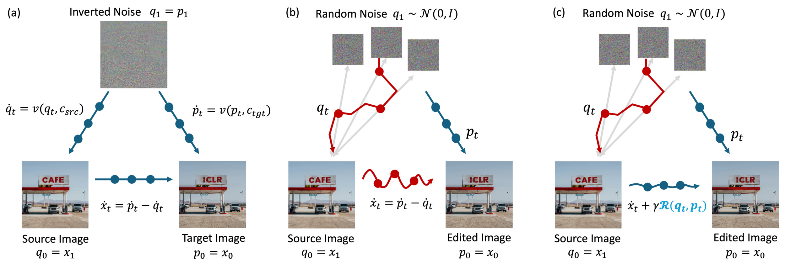

# FlowAlign Research Fork

This repository is a research fork of **FlowAlign: Trajectory-Regularized, Inversion-Free Flow-based Image Editing**.  
In addition to the original `flowalign` baseline, this fork adds two experimental variants:

- `flowdinoalign`: replaces the terminal pixel-space regularizer with a frozen DINO feature-space constraint.
- `flowlaplacianalign`: replaces the terminal pixel-space regularizer with a lightweight latent-space Laplacian pyramid constraint.

The codebase also separates **generation** and **evaluation** into two scripts for PIE-Bench experiments:

- `generate_images.py`
- `evaluate_metrics.py`



## What is included

- Stable Diffusion 3 medium editing pipeline via `diffusers`
- Flow-based editing methods:
  - `dual`
  - `sdedit`
  - `flowedit`
  - `flowalign`
  - `flowdinoalign`
  - `flowlaplacianalign`
- PIE-Bench generation and background-only evaluation
- Background metrics:
  - MSE
  - PSNR
  - SSIM
  - LPIPS-VGG
  - DINO structural distance
- Semantic metrics:
  - CLIP Score with ViT-L/14
  - HPS placeholder hook

## Requirements

Recommended environment:

```bash
conda create -n flowalign-eval python=3.10
conda activate flowalign-eval
pip install -r requirements.txt
```

For RTX 5090 / `sm_120`, use a PyTorch build with CUDA 12.8 or newer.

## Repository Layout

```text
FlowAlign-main/
├── generate_images.py          # PIE-Bench image generation
├── evaluate_metrics.py         # Local metric evaluation
├── diffusion/                  # FlowAlign samplers and editors
├── piebench_utils.py           # PIE-Bench I/O helpers
├── flowlaplacianalign_report.tex
├── data_eva.ipynb
└── assets/
```

## Supported Editing Methods

| Method | Description |
|---|---|
| `dual` | Dual-trajectory baseline |
| `sdedit` | SDEdit-style stochastic editing |
| `flowedit` | FlowEdit-style inversion-free editing |
| `flowalign` | Original FlowAlign baseline |
| `flowdinoalign` | FlowAlign with DINO feature terminal regularization |
| `flowlaplacianalign` | FlowAlign with latent Laplacian pyramid terminal regularization |

## Quick Start

### 1. Prepare models and data

This repository does **not** ship PIE-Bench or SD3 weights.

You need:

- PIE-Bench preprocessed data, e.g. `PIE_Bench_pp/`
- SD3 medium weights, either:
  - a local diffusers directory, or
  - a local single-file checkpoint such as `sd3_medium_incl_clips_t5xxlfp8.safetensors`

### 2. Generate edited images

#### FlowAlign baseline

```bash
python generate_images.py \
  --dataset_path /home/ljc/code/FlowAlign-main/PIE_Bench_pp \
  --output_dir /home/ljc/code/FlowAlign-main/eval_results_flowalign \
  --model_key /home/ljc/code/FlowAlign-main/stable-diffusion-3-medium/sd3_medium_incl_clips_t5xxlfp8.safetensors \
  --method flowalign \
  --cfg_scale 13.5 \
  --NFE 33 \
  --n_start 17 \
  --shift 3.0
```

#### FlowLaplacianAlign

```bash
python generate_images.py \
  --dataset_path /home/ljc/code/FlowAlign-main/PIE_Bench_pp \
  --output_dir /home/ljc/code/FlowAlign-main/eval_results_flowlaplacianalign \
  --model_key /home/ljc/code/FlowAlign-main/stable-diffusion-3-medium/sd3_medium_incl_clips_t5xxlfp8.safetensors \
  --method flowlaplacianalign \
  --cfg_scale 13.5 \
  --NFE 33 \
  --n_start 17 \
  --shift 3.0
```

For a fast sanity check, use:

```bash
--max_samples 100
```

### 3. Evaluate metrics locally

After generation, evaluate the results from the output directory:

```bash
python evaluate_metrics.py \
  --dataset_path /home/ljc/code/FlowAlign-main/PIE_Bench_pp \
  --pred_dir /home/ljc/code/FlowAlign-main/eval_results_flowlaplacianalign
```

This script reads local predictions and PIE-Bench ground truth, then computes:

- background MSE
- background PSNR
- background SSIM
- background LPIPS-VGG
- structural distance with DINO
- CLIP Score
- HPS placeholder value if available

The evaluator writes `metrics.json` incrementally after each sample and prints a final summary dictionary at the end.

## Reproducibility Notes

The default PIE-Bench reproduction settings used in this fork are:

- Backbone: Stable Diffusion 3 medium
- Shift coefficient: `3.0`
- Total schedule steps: `50`
- Effective NFE: `33`
- Skip early noisy steps: `17`
- CFG scale: `13.5`
- Source consistency weight: `0.01`

These settings are shared by the baseline and the two new variants so that comparisons remain fair.

## Experimental Snapshot

Representative full-set statistics from our local PIE-Bench runs:

| Method | background\_mse | background\_psnr | background\_ssim | background\_lpips\_vgg | structural\_distance\_dino | clip\_score | hps\_score |
|---|---:|---:|---:|---:|---:|---:|---:|
| `flowalign` | 0.0007111974 | 33.4599199320 | 0.9615208785 | 0.0062042582 | 0.0040374763 | 0.2433125725 | 0.2570874023 |
| `flowlaplacianalign` | 0.0027025122 | 27.7974216420 | 0.9267545959 | 0.0132680051 | 0.0113442827 | 0.2571326196 | 0.2647080776 |

## Why FlowLaplacianAlign?

`flowlaplacianalign` is designed as a lightweight alternative to feature-heavy terminal regularizers:

- no DINO dependency
- no heavy feature-space backward pass
- multi-scale frequency supervision
- easy to implement and debug
- better semantic alignment in our local runs, while keeping the FlowAlign ODE structure unchanged

It is not meant to replace the original baseline in every setting. Instead, it provides a compact structural prior for fast experimentation and ablation studies.

## Notes

- `flowdinoalign` and `flowlaplacianalign` are experimental variants added in this fork.
- `HPS` is implemented as an optional hook; if the required package is unavailable, the evaluator records `null` for that field.
- The repository intentionally keeps datasets and model weights out of version control.

## License

Please refer to the upstream FlowAlign project for the original license and citation details.

